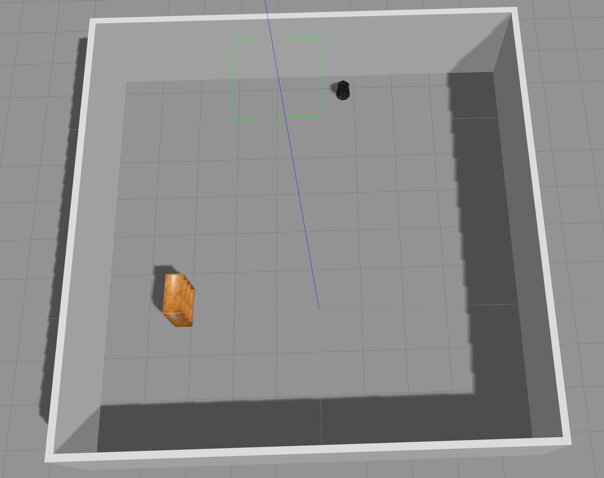

# Project Pytheas 

[](https://travis-ci.org/ysshah95/Pytheas)
[](https://coveralls.io/github/ysshah95/Pytheas?branch=master)
[](https://opensource.org/licenses/BSD-3-Clause)

# Overview

This repository is created as a Final Project for ACME Robotics (ENPM808X: Software Development in Robotics). This project aims to implement autonomous navigation and mapping in an unknown environment using TurtleBot. At a high level, the simulated robot is placed in an environment where it does not know the structure of the world. Its job is to move through the environment and avoid obstacles, all while mapping the environment via laser scans and providing an operator a visual feed of an onboard camera. The operator, via ROS services, can adjust the speed of the robot, the distance threshold that constitutes an impending collision, and also initiate a "take picture" command to capture an image of interest. In addition, an operator can initiate a "stop motion" command as well as a "resume motion" command to the robot. The developed system is capable of:

* navigating unknown environments
* robust in avoiding obstacles
* simultaneously mapping the environment and
* takes pictures when desired by the user
* stop or resume its motion as per user command
* Change its linear speed 
* change the threshold distance to detect obstacles

Few applications of the projects include:
* Navigation of known environments like offices and factories.
* Explorer bot to aid rescue efforts during natural disasters.
* Remote Surveillance

<p align="center">
<a target="_blank">
</a>
</p>


# About the Developer

This repository is developed and maintained by Yash Shah, a masters student majoring in Robotics at University of Maryland - College Park. This repository is a part of the course ENPM808X - Software Development in Robotics. 

# License 

This project is under the [BSD License](https://github.com/ysshah95/Pytheas/blob/master/LICENSE)

# Dependencies 
The dependencies of this repository are:
 ```
* Ubuntu 16.04
* ROS Kinetic
* Gazebo
* Turtlebot_Gazebo package
```

To install ROS, follow the instructions on this [link](http://wiki.ros.org/kinetic/Installation)

>Note: Gazebo & Rviz will be already installed as part of the ROS distro, however, Turtlebot_Gazebo needs to be installed separately.

To install turtlebot_Gazebo, open a terminal and run the following command: 

```
$ sudo apt-get install ros-kinetic-turtlebot-gazebo ros-kinetic-turtlebot-apps ros-kinetic-turtlebot-rviz-launchers
```

This repository also depends on the following ROS packages:
- roscpp
- geometry_msgs
- move_base_msgs
- sensor_msgs
- message_generation
- image_transport
- OpenCV & cv_bridge
- Gmapping
- map_server

To install gmapping, In a terminal:
```
sudo apt-get install ros-kinetic-slam-gmapping
```
To install Map_server, In a terminal:
```
sudo apt-get install ros-kinetic-map-server
```

# Solo Iterative Process

Solo Iterative process was used for developing this package. For detailed spreadsheet: - [SIP Link](https://docs.google.com/spreadsheets/d/1GE0tzFm89GAz18CqMhIiQ6sidgq2nOKgIXCGFF8eoEM/edit?usp=sharing)

Link to Sprint Planning Notes: [Sprint Notes Link](https://docs.google.com/document/d/1sPE6u5NXbfY2vVXfAyPOCJBkPIRnAFAd8C1skGe4AzY/edit?usp=sharing)

## Presentation 
Click here to access the presentation video : [Presentation](https://youtu.be/tE91jcoHyKs)

# Build Steps

To use this package, a catkin workspace must be setup first. Assuming catkin has been installed, run the following steps in the directory of your choice (a common one is ~/catkin_ws)
```
$ mkdir -p ~/catkin_ws/src
$ cd catkin_ws
$ catkin_make
$ source devel/setup.bash
```
Your workspace should now be setup and you should be able to use ros commands like `roscd` and `rosls`. Note that if you cannot use these commands or can't find ROS packages, try running `source devel/setup.bash` again in your catkin workspace.

To build the Pytheas Project ROS package in this repository, first clone the repository into the catkin `src` directory:
```
$ cd ~/catkin_ws/src
$ git clone https://github.com/ysshah95/Pytheas.git
```
Now simply run catkin_make to build the ROS package.
```
$ cd ~/catkin_ws
$ catkin_make
```

# Running the Demo using Launch File
To run the demo we need to run two launch files. First launch file loads the Gazebo environment and runs the terrapinavigator node to explore and map the environment. The seconds lauch file loads rviz (for visualization) and gmapping (for SLAM and Mapping).

After following the build instructions:

To run the demo, in a new terminal:
```
$ cd ~/catkin_ws/
$ source devel/setup.bash
$ roslaunch pytheas finalProject_demo.launch
```

This will load the turtlebot in the gazebo world and wait for 15 seconds. Now to run gmapping and Rviz, in a new terminal:

```
$ cd ~/catkin_ws/
$ source devel/setup.bash
$ roslaunch pytheas demo_rviz.launch 
```

This will start the gmapping package and load rviz for visualization.

## Saving the map
After the map is properly created in rviz, to save the map type the following comands in new terminal.

```
$ cd ~/catkin_ws/pytheas/results
$ rosrun map_server map_saver -f <map_name>
```

To view the saved map. In a new terminal

```
$ eog <map_name>.pgm
```

# Interacting with the Turtlebot using rosservice

## Taking an Image with takeImageService service
When the turtlebot is moving, you may see something that you wish to take a picture of in your image view window. To do so, you can issue a ```rosservice``` call to the turtlebot. The turtlebot will see this service and change the ```takeImage``` flag so that next time it sees the ```/camera/rgb/image_raw``` topic, it will take and save an image. To make this service call, open a new terminal, change directories to your workspace, source the directory, and call rosservice:

```
$ cd ~/catkin_ws
$ source devel/setup.bash
$ rosservice call /takeImageService true
```

The images are saved in ~/.ros/ directory. Follow these commands to see the images.

```
gnome-open ~/.ros/
```

>Note: If it says to install gnome, follow the command written in terminal to install gnome.

It will pop up a folder where all the images are saved. An example of the image is shown below. 

<p align="center">
<a target="_blank">
</a>
</p>

## Change Forward Speed with changeSpeedService service

You may also want to change the speed at which the Turtlebot moves forward. To do so, you can issue another ```rosservice``` call to the turtlebot. The robot will see this service and change the ```forwardSpeed``` parameter to the value passed in to the service. To make this service call, open a new terminal, change directories to your workspace, source the directory, and call rosservice:

```
$ cd ~/catkin_ws
$ source devel/setup.bash
$ rosservice call /changeSpeedService 1.0
```

The default speed is 0.25 m/s. The above command will change this to 1.0 m/s, causing the turtlebot to move faster in the positive x-direction.

## Change obstacle detection threshold with changeThresholdService service

Another parameter that can be modified via ```rosservice``` is the distance threshold at which the turtlebot start rotating on its place to avoid an obstacle. To make this service call, open a new terminal, change directories to your workspace, source the directory, and call rosservice:

```
$ cd ~/catkin_ws
$ source devel/setup.bash
$ rosservice call /changeThresholdService 0.5
```

The default threshold is 1 m. The above command will change this to 0.5 m, causing the turtlebot to get closer to an obstacle before its starts rotating on its place. 

## Pause / Resume Turtlebot motion with toglePauseMotion service

Using ```rosservice```, we can also tell the Turtlebot to stop in place (or subsequently resume its motion). To make this service call, open a new terminal, change directories to your workspace, source the directory, and call rosservice:

```
$ cd ~/catkin_ws
$ source devel/setup.bash
$ rosservice call /togglePauseMotionService true
```

Passing in ```true``` will cause the Turtlebot to stop in place if it is not already stopped, while passing in ```false``` will make the Turtlebot resume motion if it is not already moving. Note that the sensor data will continue to stream, it is only the Turtlebot that will stop.

# Running Rostest
Unit tests and ROS tests have been written for this repository. To run these tests, open a new terminal and change directories to your catkin workspace. Then, run the tests using catkin and the test launch file:

```
$ cd ~/catkin_ws/src
$ catkin_make run_tests && catkin_test_results
```

# Rosbag Feature
The package ```rosbag``` is a common ROS tool that is used to record and playback ROS topic messages. The launch file for this project accepts a boolean flag called ```record``` that toggles rosbag recording if included (true for record, false for do not record). By default the rosbag is run (recorded) for 30 seconds. To run the package and record the published topics, run:

```
$ cd ~/catkin_ws/
$ source devel/setup.bash
$ roslaunch pytheas finalProject_demo.launch record:=true
```

The bag will be saved in /results directory.

## Playback using rosbag
We can playback this recorded data to recreate a recorded scenario. Assuming a rosbag recording has taken place according to the above process, playback the rosbag file by executing:

```
$ ~/catkin_ws/src/Pytheas/results
$ rosbag play pytheas.bag
```

# Doxygen Documentation
The documentation for this project is created using doxygen-gui. To generate the documentation again, please execute following the commands:

```
sudo apt-get install doxygen
sudo apt-get install doxygen-gui
doxywizard
```

The documentation for this project can be found at the path docs/html/index.html.

Once the gui is open, select the workspace as the repository. Fill the details as required and set the source code folder to this repository. As a destination directory, create a new folder "Documentation" in the repository and select it. Following the further steps would create the documentation.


## Known Issues/Bugs 

The map created by current build is okay but not perfect. To make it more accurate, I think the autonomous navigation algorithm needs to be changed. I have used the walker (roomba type algorithm) algorithm, but it does go to every place of the environment. Hence, a random navigation algorithm along with walker algorithm could be more beneficial.  